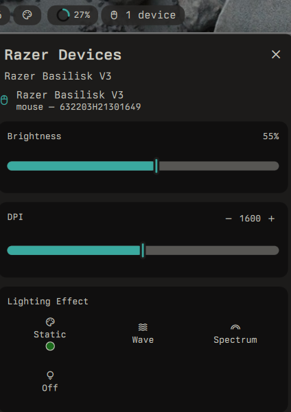

# Razer Device Manager

A [DankMaterialShell](https://github.com/AvengeMedia/DankMaterialShell) plugin for controlling Razer peripherals via [OpenRazer](https://openrazer.github.io/).



## Features

- Brightness control across all connected devices
- Lighting effects (static, wave, spectrum) with color picker
- DPI adjustment with logarithmic slider
- Battery monitoring for wireless devices
- Auto lights-off on screen lock, sleep, or idle
- Device capability detection — only shows supported effects

## Requirements

- [OpenRazer](https://openrazer.github.io/) daemon running (`openrazer-daemon`)
- [Go](https://go.dev/) 1.21+ (required to build the CLI binary)
- DMS >= 1.4.0

### Installing dependencies

**Arch:**
```
sudo pacman -S openrazer-daemon go
systemctl --user enable --now openrazer-daemon
```

**Fedora:**
```
sudo dnf install openrazer golang
systemctl --user enable --now openrazer-daemon
```

**Ubuntu:**
```
sudo apt install openrazer-daemon golang-go
systemctl --user enable --now openrazer-daemon
```

## Installation

### From the plugin registry

```
dms plugins install dankRazer
```

Then build the CLI:

```
cd ~/.config/DankMaterialShell/plugins/dankRazer
./build.sh
```

### Manual

Clone into your plugins directory:

```
cd ~/.config/DankMaterialShell/plugins
git clone https://github.com/zachfi/dms-razer dankRazer
cd dankRazer
./build.sh
```

Enable the plugin in DMS Settings > Plugins.

## Settings

| Setting | Description | Default |
|---------|-------------|---------|
| Refresh Interval | Device polling interval (seconds) | 30 |
| Default Static Color | Hex color for static effect | 00ff00 |
| Default Reactive Color | Hex color for reactive effect | 00ffff |
| Sync All Devices | Apply changes to all connected devices | On |
| Auto Lights Off | Turn off lighting on lock/sleep/idle | On |

## CLI

The plugin includes `dankrazer-cli`, a Go binary that communicates with OpenRazer over D-Bus. It can also be used standalone:

```
dankrazer list --json          # List devices with capabilities
dankrazer brightness --all 80  # Set brightness on all devices
dankrazer effect static ff0000 # Set static red
dankrazer effect spectrum      # Rainbow cycle
dankrazer effect --all none    # Turn off all lighting
dankrazer effect restore       # Restore last saved effect
dankrazer dpi 1600             # Set DPI
```

## License

MIT
